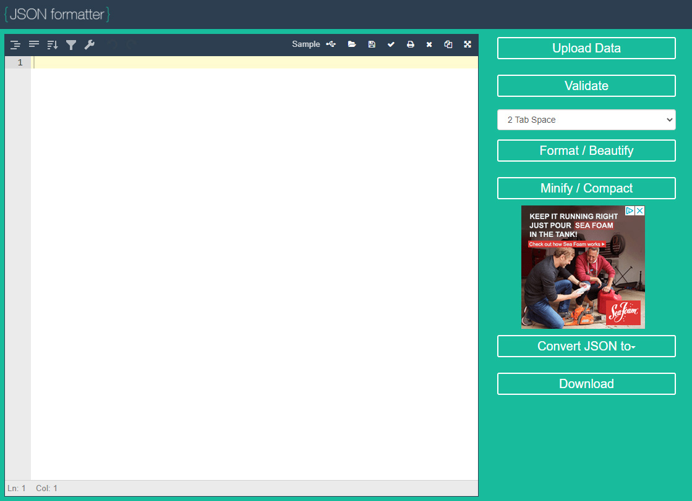
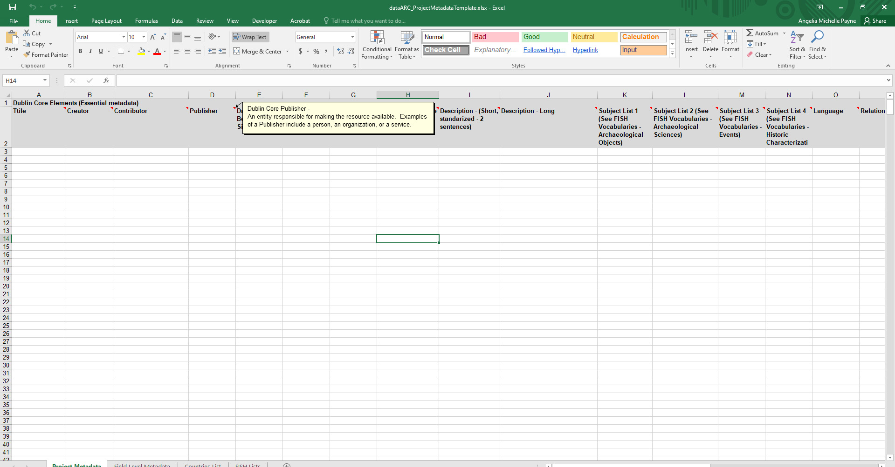
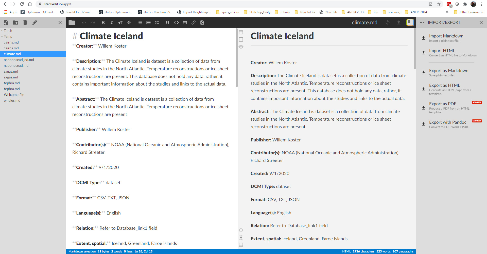
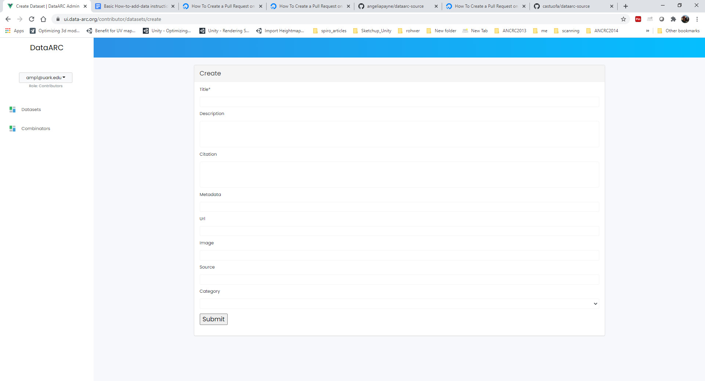
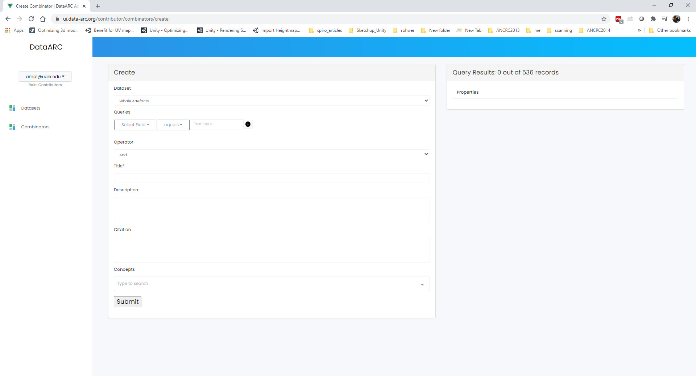
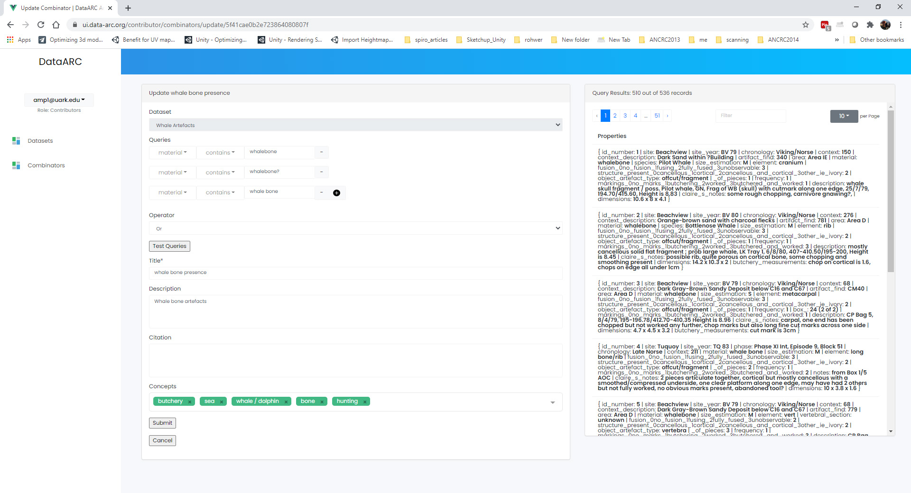

Convert your data to GeoJSON and Validate (The spatial component of your data)
---------------------------------------------------------------------------------
By now you should have a better understanding of the basics for preparing your data for dataARC.  You should know how to create combinators in order to map your data to the dataARC concept map and you should have a good sense of what concepts are applicable to your dataset. 

If you have stepped through some of the exercises using the dataARC Ecosystem Explorer, you know that dataARC requires data to be in the GeoJSON format.  GeoJSON is an `open standard format <https://tools.ietf.org/html/rfc7946#section-3.1.2>`__ for representing simple geographic features, in this case point locations, with attribute information.  There are several free tools available online for converting your data to GeoJSON.  `Convert CSV for GeoJSON <https://www.convertcsv.com/csv-to-geojson.htm>`__ is free and is relatively straightforward and easy-to-use.  Feel free to use any GeoJSONconverter available to you. Remember that point locations must be stored as latitude and longitude and in separate columns in your table.

Next it is important to validate your newly created JSON file to ensure that the file is valid before importing it into dataARC.  As with converters, there are a lot of free GeoJSON validators online.  We recommend the following:

`JSON Formatter <https://jsonformatter.org/>`__  is one of the easiest yet advanced formatting and validating tools.  It can be used as a JSON validator, editor, and viewer.  While a login isn’t required to save your JSON data, data saved without a login becomes public.  To ensure that your data is private, create an account and login first.  

`GeoJSON IO <https://geojson.io/#map=4/53.57/-39.29>`__ is largely a viewer for GeoJSON data but also offers some conversion options (including CSV).  This interactive viewer allows you to drop your newly created JSON file onto the map and visualize the data quickly. 

A Note about Dates  (The temporal component of your data)
---------------------------------------------------------

How we reference time varies considerably across different disciplines.  Visit the `Time Synthesis section <https://www.data-arc.org/time/>`__ of the dataARC website for a more detailed discussion of this topic.  To ensure compatibility with the temporal filter options in dataARC, dates can be entered as a single discrete value or a date range.  Dates must also be entered in Common Era/Before Common Era (CE/BCE) numerical format where **CE dates are indicated with a positive number and BCE dates are indicated with a negative number.**   

Create Project and Field-Level Metadata for your dataset
------------------------------------------------------------

Metadata is essential because it allows others to know your dataset as well as you do.  Therefore documenting the specifics of your project, how and when the data was collected, and providing descriptions for individual fields is very important.  dataARC requires that you create a markdown (.md) and XML file for your metadata to accompany your geoJSON file.  Metadata templates are provided on Github at https://github.com/castuofa/dataarc-source/tree/main/metadata-templates.

   
The Excel file is recommended for structuring your metadata and to facilitate adding the information to the .md and .xml templates.  Upon downloading and opening the project_metadata_template.xlsx template, you will see a workbook with four sheets (four tabs at the bottom).  The first two tabs (Project Metadata and Field Level Metadata) need to be completed.  The last two tabs (Countries List and FISH Lists) are references to use when completing the Project Metadata.

In the Project Metadata, the first fifteen fields with a light gray background are **the required Dublin Core metadata elements** to complete for your project.   The additional fifteen fields with a dark gray background are not required however they provide important information about you and your research that will be provided on the dataARC project website.Hovering over the title for each field provides a short popup description of what information needs to be provided for that field with details on formatting, etc.  If additional guidance is needed for the Dublin Core elements, please visit the `Dublin Core website <https://www.dublincore.org/specifications/dublin-core/dces/>`__ or view examples of other project metadata in the About the Dataset pages on the dataARC website.

The Field Level metadata provides the option for you to provide detailed information about all of the fields in your dataset.  As with the project metadata, hovering over the field title provides a description of what to provide in that field. The description field is used to provide the specifics (value ranges, units of measurement, formats, etc…) for the fields in your data.  Provide all information that will be relevant to the end user. 

Once the project and field level metadata are complete, you are ready to add it to the markdown and XML templates.  The recommended editor for markdown files is `StackEdit IO <https://stackedit.io/app#>`__, an in-browser editor that allows you to open and edit the provided template.  Note that you will only add the 15 Dublin Core elements to the MD and XML files.  

   
To edit the markdown file, go to https://stackedit.io/app# and select Start Writing.  Open mardownk_template.md.  The template contains the titles for the Dublin Core elements; you simply need to fill in the values for your data from your Excel spreadsheet.  The editor is straightforward to use with the ability to add text in the left panel and see the results with markdown formatting on the right.  Transferring the fields to the template should be fairly straightforward but refer to the text below for any questions

**Markdown File to Dublin Core elements**
- Title - Title
- Creator - Creator
- Description - Both Short and Long Description fields combined
- Publisher - Publisher
- Contributor(s) - Contributor(s)
- Created - Start Date or Date Range if provided
- DCMI Type - Type
- Format - Format
- Language - Language
- Relation - Relation
- Extent, spatial -  Spatial Coverage
- Extent, temporal -  Temporal Coverage

Below the project metadata, you will add the fields level metadata.  To add the data in tabular format, use the pipe symbol (|) to separate cells.  More details are provided in the template form.  

Once both the project and field level metadata is complete, select Export as Markdown from the import/export options in the right panel.  Save the file to your local drive. You will upload the geoJSON, MD, and XML files together when all are complete. 

To edit the XML file, we recommend using Notepad ++, a free download from `here <https://notepad-plus-plus.org/downloads/>`__.  You can use regular Notepad that comes standard with Windows, however Notepad++ is strongly advised because it provides color coding that helps in creating XML files.  There are instructions provided in the XML file to edit it directly.  You can also use the `Advanced Dublin Core Generator <https://nsteffel.github.io/dublin_core_generator/generator.html>`__ but you will have to edit the file to add FISH Subject lists separately.  For ease of use, we recommend editing the editing the XML file directly using Notepad++.  Once you have added both your project and field level metadata to the XML template, save the XML file in the same location as the geoJSON and MD files.  You are now ready to upload your data and metadata to Github!

Create a Github Account and add your data
--------------------------------------------

If you haven’t already, create a Github account and navigate to the `dataARC source repository <https://github.com/castuofa/dataarc-source.>`__  `Digital Ocean <https://www.digitalocean.com/community/tutorials?q=github>`__ (referenced here) has a good set of tutorials to familiarize you with working with data in Github.  Feel free to look at other sections of their documentation for additional information.

1.  `Fork <https://www.digitalocean.com/community/tutorials/how-to-create-a-pull-request-on-github#create-a-copy-of-the-repository>`__ the dataarc-source repository with the "Fork" button located on the right side of the screen.  

2.  `Clone <https://www.digitalocean.com/community/tutorials/how-to-create-a-pull-request-on-github#clone-the-repository>`__ your newly copied repository to your machine

3.  `Make/Commit/Push <https://www.digitalocean.com/community/tutorials/how-to-create-a-pull-request-on-github#make-changes-locally>`__ changes to your forked repository - dataset changes will be in the datasets folder specifically

4.  Next, `Create a Pull Request <https://github.com/castuofa/dataarc-source/tree/main/datasets>`__ from your forked repository to be merged with the main branch on dataarc-source. Here is `an example <https://github.com/castuofa/dataarc-source/pull/5>`__ - the template will appear automatically for every pull request and should be filled out by the contributor.

5.  At this point, a moderator of the dataARC repository will decide whether or not to accept your pull request. They may ask for you to edit or revise your code prior to accepting the pull request.  

6.  Once approved by a moderator and merged, you will add your dataset to the dataarc admin panel using the instructions below. 
 
 

Create a dataARC account and finish adding your dataset
--------------------------------------------------------

1.  Before you begin, you will need to create an account with the dataARC Search Tool to become a data contributor.  Go to the dataARC Search Tool and select Signup.  Fill out the form and select Register.  

2.  Now, select the Login option from the menu and Login using your credentials.

3. Click on the Manage - Admin button and select Add a New Dataset.  Fill in all of the fields about your new dataset.

*  *Title:* The formal title for your dataset.
*  *Description:* A short two sentence description about your dataset.  Suggested formatting: The - Title of Resource - is/includes/contain/encompasses - the primary subject and topics of dataset with possible reference to time, place, etc..  Additional short descriptive sentence. 
*  *Citation:*  Recommended format for citing your dataset
*  *Metadata:*  Link to the markdown metadata file in Github For example: datasets/nabonosead/nabonosead.md
*  *URL:*  Link to original data source or relevant project website
*  *Image:*  An image that can be used to accompany your data description.
*  *Source:*  The path with the Github repo to the GeoJSON file.  For example: datasets/nabonosead/nabonosead.geojson
*  *Category:*  Choose between Archaeological, Textual, or Environmental.
  
4. Once all fields have been completed, press the Submit button.

5. If all information has been filled out and the correct relative path to the dataset exists in Github, your dataset is ready to process.  Hit the “Process” button.  There will be short wait period while your dataset is being processed.  Once complete, you are ready to start adding combinators. 

6. Now when you go to the Admin panel and select “Datasets” on the left side of the screen,your dataset will be listed with the other dataARC datasets.  

Add Combinators to your dataset
-------------------------------------

Now that your dataset has been added to dataARC, you are ready to create combinators to map your dataset to the dataARC Concept Map.  Refer back to the Guides for creating good mappings if you need a refresher on what types of combinators/concepts should be mapped to your dataset. 

1.  Select Combinators on the left side of the screen and press the Add New Combinator on the right.

2.  Once the Add New Combinators dialog box opens, select your dataset from the dropdown list.  

3.  When you select your dataset,  all of the fields in your dataset are now available under the Queries options.  Select a field in your dataset and begin to create a query.  The type of field that you select (numeric vs text) will determine the query expressions that are available.  Numeric fields (such as dates, measurements, etc) will have the following expressions available: equals, not equals, greater than, less than, less than or equal to, and greater than or equal to.  While text fields will have the following expressions available: equals, not equals, contains, not contains, starts with, and ends with.

.. note:: Example queries might include specifying a date range,  isolating a specific material type in an archaeological dataset, searching a description field for a keyword (s), isolating an indicator for a specific plant or animal, isolating locations with a specific criteria (coastal, inland, etc…).  The options here are endless.  You might reference other combinators created by previous contributors to get more ideas. 

4.  As you are creating your query, it is important to think query logic if you are combining multiple criteria for your query. For example, you might be interested in isolating whale bones from the Early Viking Period or looking at multiple indicators for human occupation; therefore you will need to choose an appropriate logic operator to combine your queries.  The available logic operators are: and, or, not, nor and the definitions below are provided from `Logical Query Operators — MongoDB Manual <https://docs.mongodb.com/manual/reference/operator/query-logical/>`__

   *   And: 	Joins query clauses with a logical AND returns all documents that match the conditions of both clauses.

   *   Or:   Joins query clauses with a logical OR returns all documents that match the conditions of either clause.

   *   Not:  Inverts the effect of a query expression and returns documents that do not match the query expression.

   *   Nor:   Joins query clauses with a logical NOR returns all documents that fail to match both clauses.

- For both of the negation operators, a value is also considered false if the attribute is set to "null" or doesn't exist.

5.  Once you have completed your query and chose the appropriate operator (if necessary).  Hit the Test Queries button.  Your query is successful if a new records set is returned on the right side of the page.

6. Now that you have created and tested your query and it functions correctly, finish completing the information for the combinator.  Give the combinator an appropriate title, description, and citation.  Finally, choose the appropriate concept(s) from the concept list that accurately describe the newly queried dataset.  See the example below that selects whale bones (with all possible spellings) from a materials list to identify the presence of whale bone at a site.  Note the five concepts applied to the query:  butchery, sea, whale/dolphin, bone, and hunting.   

7.  Continue to add more combinators to map your dataset to the dataARC concept map. 
