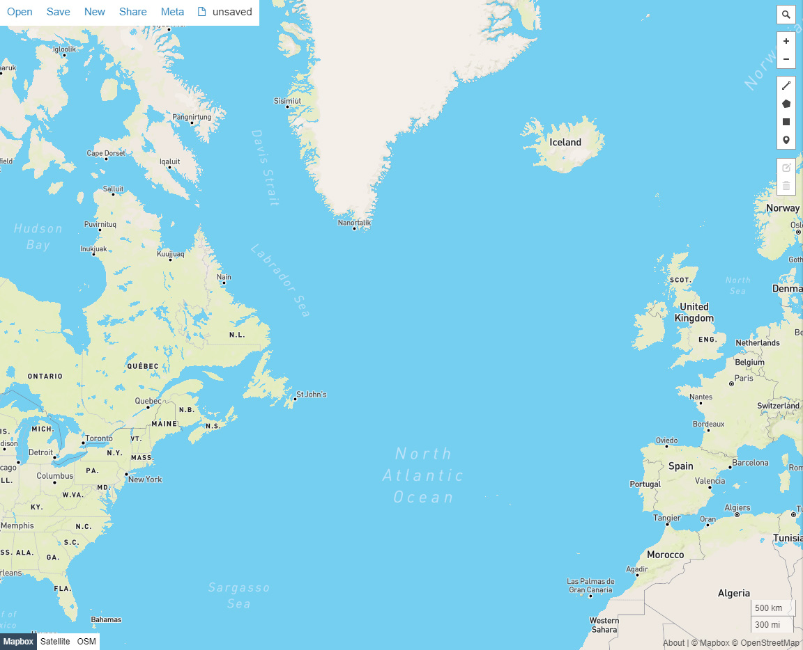

Convert your data to GeoJSON and Validate (The spatial component of your data)
---------------------------------------------------------------------------------
By now you should have a better understanding of the basics for preparing your data for dataARC.  You should know how to create combinators in order to map your data to the dataARC concept map and you should have a good sense of what concepts are applicable to your dataset. 

If you have stepped through some of the exercises using the dataARC Ecosystem Explorer, you know that dataARC requires data to be in the GeoJSON format.  GeoJSON is an `open standard format <https://tools.ietf.org/html/rfc7946#section-3.1.2>`__ for representing simple geographic features, in this case point locations, with attribute information.  There are several free tools available online for converting your data to GeoJSON.  `Convert CSV for GeoJSON <https://www.convertcsv.com/csv-to-geojson.htm>`__ is free and is relatively straightforward and easy-to-use.  Feel free to use any GeoJSONconverter available to you. Remember that point locations must be stored as latitude and longitude and in separate columns in your table.

Next it is important to validate your newly created JSON file to ensure that the file is valid before importing it into dataARC.  As with converters, there are a lot of free GeoJSON validators online.  We recommend the following:

.. image:: _static/JSONFormatter.jpg
   :width: 400
   :class: align-left
`JSON Formatter <https://jsonformatter.org/>`__  is one of the easiest yet advanced formatting and validating tools.  It can be used as a JSON validator, editor, and viewer.  While a login isn’t required to save your JSON data, data saved without a login becomes public.  To ensure that your data is private, create an account and login first.  

|
|
|
|

`GeoJSON IO <https://geojson.io/#map=4/53.57/-39.29>`__ is largely a viewer for GeoJSON data but also offers some conversion options (including CSV).  This interactive viewer allows you to drop your newly created JSON file onto the map and visualize the data quickly. 

|
|
|
|

A Note about Dates  (The temporal component of your data)
---------------------------------------------------------

How we reference time varies considerably across different disciplines.  Visit the `Time Synthesis section <https://www.data-arc.org/time/>`__ of the dataARC website for a more detailed discussion of this topic.  To ensure compatibility with the temporal filter options in dataARC, dates can be entered as a single discrete value or a date range.  Dates must also be entered in Common Era/Before Common Era (CE/BCE) numerical format where **CE dates are indicated with a positive number and BCE dates are indicated with a negative number.**   

Create a Github Account and add your data
--------------------------------------------

If you haven’t already, create a Github account and navigate to the `dataARC source repository <https://github.com/castuofa/dataarc-source.>`__  `Digital Ocean <https://www.digitalocean.com/community/tutorials?q=github>`__ (referenced here) has a good set of tutorials to familiarize you with working with data in Github.  Feel free to look at other sections of their documentation for additional information.

1.  `Fork <https://www.digitalocean.com/community/tutorials/how-to-create-a-pull-request-on-github#create-a-copy-of-the-repository>`__ the dataarc-source repository with the "Fork" button located on the right side of the screen.  

2.  `Clone <https://www.digitalocean.com/community/tutorials/how-to-create-a-pull-request-on-github#clone-the-repository>`__ your newly copied repository to your machine

3.  `Make/Commit/Push <https://www.digitalocean.com/community/tutorials/how-to-create-a-pull-request-on-github#make-changes-locally>`__ changes to your forked repository - dataset changes will be in the datasets folder specifically

4.  Next, `Create a Pull Request <https://github.com/castuofa/dataarc-source/tree/main/datasets>`__ from your forked repository to be merged with the main branch on dataarc-source. Here is `an example <https://github.com/castuofa/dataarc-source/pull/5>`__ - the template will appear automatically for every pull request and should be filled out by the contributor.

5.  At this point, a moderator of the dataARC repository will decide whether or not to accept your pull request. They may ask for you to edit or revise your code prior to accepting the pull request.  

6.  Once approved by a moderator and merged, you will add your dataset to the dataarc admin panel using the instructions below. 
 
 

Create a dataARC account and finish adding your dataset
--------------------------------------------------------

1.  Before you begin, you will need to create an account with the dataARC Search Tool to become a data contributor.  Go to the dataARC Search Tool and select Signup.  Fill out the form and select Register.  

2.  Now, select the Login option from the menu and Login using your credentials.

3. Click on the Manage - Admin button and select Add a New Dataset.  Fill in all of the fields about your new dataset.

.. image:: _static/dataARC_addnew.jpg

  *  Title: The formal title for your dataset.
  *  Description: A short two sentence description about your dataset.  Suggested formatting: The - Title of Resource - is/includes/contain/encompasses - the primary subject and topics of dataset with possible reference to time, place, etc..  Additional short descriptive sentence. 
  *  Citation:  Recommended format for citing your dataset
  *  Metadata:  Link to the markdown metadata file in Github For example: datasets/nabonosead/nabonosead.md
  *  URL:  Link to original data source or relevant project website
  *  Image:  An image that can be used to accompany your data description.
  *  Source:  The path with the Github repo to the GeoJSON file.  For example: datasets/nabonosead/nabonosead.geojson
  *  Category:  Choose between Archaeological, Textual, or Environmental.
  
4. Once all fields have been completed, press the Submit button.

5. If all information has been filled out and the correct relative path to the dataset exists in Github, your dataset is ready to process.  Hit the “Process” button.  There will be short wait period while your dataset is being processed.  Once complete, you are ready to start adding combinators. 

6. Now when you go to the Admin panel and select “Datasets” on the left side of the screen,your dataset will be listed with the other dataARC datasets.  

Add Combinators to your dataset
-------------------------------------

Now that your dataset has been added to dataARC, you are ready to create combinators to map your dataset to the dataARC Concept Map.  Refer back to the Guides for creating good mappings if you need a refresher on what types of combinators/concepts should be mapped to your dataset. 

1.  Select Combinators on the left side of the screen and press the Add New Combinator on the right.

2.  Once the Add New Combinators dialog box opens, select your dataset from the dropdown list.  

.. image:: _static/dataARC_Addcombinator.jpg

3.  When you select your dataset,  all of the fields in your dataset are now available under the Queries options.  Select a field in your dataset and begin to create a query.  The type of field that you select (numeric vs text) will determine the query expressions that are available.  Numeric fields (such as dates, measurements, etc) will have the following expressions available: equals, not equals, greater than, less than, less than or equal to, and greater than or equal to.  While text fields will have the following expressions available: equals, not equals, contains, not contains, starts with, and ends with.

.. note:: Example queries might include specifying a date range,  isolating a specific material type in an archaeological dataset, searching a description field for a keyword (s), isolating an indicator for a specific plant or animal, isolating locations with a specific criteria (coastal, inland, etc…).  The options here are endless.  You might reference other combinators created by previous contributors to get more ideas. 

4.  As you are creating your query, it is important to think query logic if you are combining multiple criteria for your query. For example, you might be interested in isolating whale bones from the Early Viking Period or looking at multiple indicators for human occupation; therefore you will need to choose an appropriate logic operator to combine your queries.  The available logic operators are: and, or, not, nor and the definitions below are provided from `Logical Query Operators — MongoDB Manual <https://docs.mongodb.com/manual/reference/operator/query-logical/>`__

   *   And: 	Joins query clauses with a logical AND returns all documents that match the conditions of both clauses.

   *   Or:   Joins query clauses with a logical OR returns all documents that match the conditions of either clause.

   *   Not:  Inverts the effect of a query expression and returns documents that do not match the query expression.

   *   Nor:   Joins query clauses with a logical NOR returns all documents that fail to match both clauses.

- For both of the negation operators, a value is also considered false if the attribute is set to "null" or doesn't exist.

5.  Once you have completed your query and chose the appropriate operator (if necessary).  Hit the Test Queries button.  Your query is successful if a new records set is returned on the right side of the page.

6. Now that you have created and tested your query and it functions correctly, finish completing the information for the combinator.  Give the combinator an appropriate title, description, and citation.  Finally, choose the appropriate concept(s) from the concept list that accurately describe the newly queried dataset.  See the example below that selects whale bones (with all possible spellings) from a materials list to identify the presence of whale bone at a site.  Note the five concepts applied to the query:  butchery, sea, whale/dolphin, bone, and hunting.   

.. image:: _static/dataARC_Addcombinator2.jpg

7.  Continue to add more combinators to map your dataset to the dataARC concept map. 
