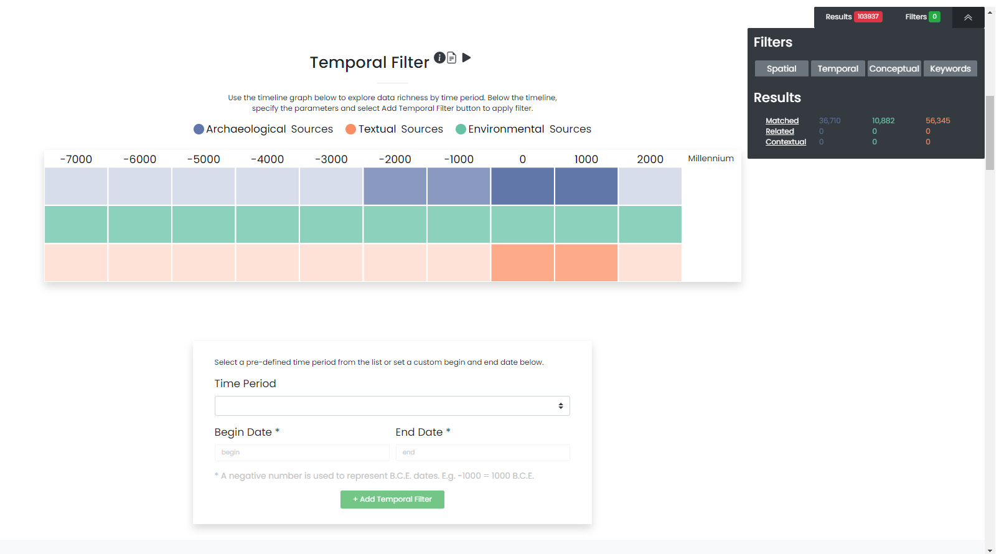
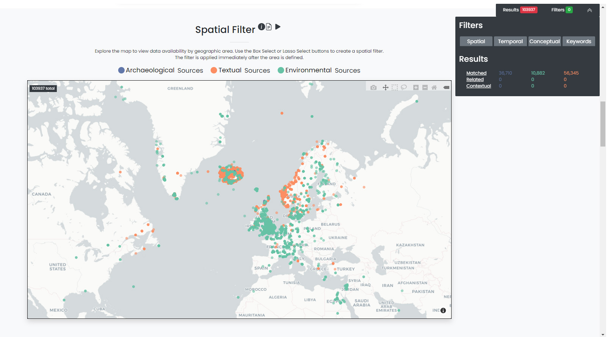

.. raw:: html

    
    
    
    
.. role:: bluish
.. role:: orangish
.. role:: greenish

What is the purpose of the dataArc search tool?
===============================================
This dataARC search tool is designed to help students and researchers discover and explore diverse interconnected data sources relevant for interdisciplinary studies of long-term human ecodynamics in the North Atlantic. Search results produced through this tool will include data provided by specialists in different domains, information about the connections between these datasets, and background information about the data sources and how they are typically used. The aim of the tool is to encourage users to assess the potential relevance to their research of datasets from outside their own area of expertise. It’s important to understand how datasets are interconnected in the tool to apply filters effectively and interpret your search results correctly. 

.. image:: _static/dataarc.jpg

What kind of data is available through the search tool?
========================================================
The dataArc search tool includes diverse datasets contributed by researchers working in domains from Saga Studies through paleoentomology. Because the data are quite varied, and because these very different types of data have to be analysed and interpreted in different ways, we’ve categorized them into three general types:  archaeological, textual, and environmental.  Throughout the dataARC Search Tool, archaeological sources are always shown in blue, textual in orange, and environmental in green.  This simple color scheme is used throughout to visually categorize the data visualization graphs, filter, and result options. 

How do I run a basic search?  What happens when multiple filters are applied?
=============================================================================

There are four methods for filtering or querying data in dataARC:
        -          Time (temporal filter)
        -          Space (spatial or geographic filter)
        -          Concepts (conceptual filter based on an ontology)
        -          Keyword (traditional keyword search)
        
A user may choose to define one or a combination of filters.  The time, space, and concept filters each feature a graph that provides the user with a quick visual indication of the quantity of data available for different time periods, different locations, and connected to different concepts.  As the user begins to filter the data, the information depicted in each graph changes based on the newly filtered results.  For example, if the user applies a temporal filter of 500-700 CE and gets a 2,500 result subset, then the map and concepts visualizations are updated to only show the data from those 2,500 newly selected records.  The aim is to help researchers identify areas that are data-rich across multiple datasets. Most users will be familiar with where the data-rich areas are for their own domain, but won't know where good sets of complementary data from other domains are available. A detailed guide on how to use each filter is provided in the sections below.

.. note:: Helpful Tip:  The filters do not need to be completed in any particular order.  Feel free to start with a concepts filter.  We recommend applying a filter and then revisiting the other data visualization graphs to view the changes that reflect the newly selected data.  The dynamic data visualization graphs are a powerful feature of dataARC.

Temporal Filter: How do I use the timeline graph to create a temporal filter?
=============================================================================
The dataARC timeline provides a visual indication of data availability or richness for different temporal ranges (e.g. millennium, century, and decade).  If you have a specific time period that you are interested in, it is recommended to explore the timeline graph to assess data availability for your defined period.  The data in the timeline are displayed according to the dataARC color scheme (:bluish:`archaeological`, :orangish:`textual`, and :greenish:`environmental`) with **darker colors indicating more data and lighter colors indicating less data.**  

Assess data availability and create a temporal filter for a period of interest
-------------------------------------------------------------------------------

1.  To begin using the timeline graph, select a millennium of interest.  Once a millennium is selected, the graph changes to show the data availability by century.  Select a century (if applicable).  The graph changes again to show data availability by decade.  Select a decade (if applicable).

2.  To view exact data numbers, hover over each colored square in the graph to view the exact number of data records available in the desired time period.  

3.  When you are ready to begin entering your filter parameters, it is important to note that the time last selected in the timeline graph will be auto-populated in the Start Date and End Date boxes of the Filter dialog.

4.  Modify the Start and End Dates if necessary to reflect the period of interest.  Make sure all BCE dates are represented with a negative number.

5.  Select Add Temporal Filter. 

.. note:: Note:  If little data is available for the desired time period, consider widening your date range to include more data.  Use the graph to view data richness in neighboring time windows to better inform your decision.

Create a Temporal Filter for a predefined time period. 
---------------------------------------------------------

Archaeologists, geologists, climatologists, and literary historians all think about time differently. Predefined time periods are focused on discrete events (e.g. the Indonesian volcano eruption in 1257), rapid events (e.g. the Black Death in Norway from 1347-1350), or larger periods of time (e.g. the Early Medieval Period from 1050-1250) that are commonly referenced in the different disciplines represented in dataARC.  

1.  To see a list of the available predefined time periods,  select the dropdown list under Time Period.

2.  Choose a predefined time period. 

3.  Ensure the start and end dates match the desired predefined time period. Make sure all BCE dates are represented with a negative number.

4.  Select Apply Filter

Evaluate Results (optional)
--------------------------------
1.  Once the filter has been applied, the gray Filter and Results dialogue box on the right of the screen will update to show the new filter and results subsets.

2.  Click on the Matched, Related, or Contextual texts to go to the appropriate result section at the bottom of the screen (and go to the Interpreting Results section in this document) or continue on to another section to add another filter.

.. note::  Note: The data displayed in the other visualization graphs (map and concepts) will be updated based on the temporal filter and the new results subset.

Spatial Filter: How do I use the maps to create a spatial filter?
===================================================================

Much like the timeline, the dataARC map interface is meant to rapidly convey data availability and richness across the multiple countries and island groups that make up the North Atlantic.

Assess data availability for a area/country of interest and create a spatial filter
--------------------------------------------------------------------------------------
1.  First zoom in on the map and view the distribution of :bluish:`archaeological`, :orangish:`textual`, and :greenish:`environmental` records available for your area of interest. To zoom in on the map, either scroll or use the plus and minus icons located in the upper right corner of the map.  Pan using the left mouse button.

2.  Once an area of interest has been identified, use the Box Select or Lasso Select tools located in the upper right corner to draw a polygon around the area.   The filter is automatically applied when you release the left mouse button.

Evaluate Results (optional)
--------------------------------
1.  Once the filter has been applied, the gray Filter and Results dialogue box on the right of the screen will update to show the new filter and results subsets.

2.  Click on the Matched, Related, or Contextual texts to go to the appropriate result section at the bottom of the screen (and go to the Interpreting Results section in this document) or continue on to another section to add another filter.

.. note::  Note: The data displayed in the other visualization graphs (timeline and concepts) will be updated based on the temporal filter and the new results subset.

Conceptual Filter: How do I use the concept map to create a conceptual filter?
================================================================================
Concepts are used to build links across the different disciplines’ datasets represented within dataARC. Building these links is important and is quite challenging in practice! How a zooarchaeologist thinks about and identifies different types of fish and fishing-related activities is quite different from how a saga specialist thinks about the same topics. Yet both researchers do work that involves thinking about and studying them. DataArc uses a ‘map’ of these shared concepts, like fish and fishing, as points of connection between data used by different domains.

This map of shared concepts was developed by the dataArc community in the form of a domain ontology, also referred to in our documentation as a concept map, around the central concept of the 'changing landscape' in the North Atlantic. All of the concepts shown on the concept map are broadly related to, or directly connected to, one another.  This concept map, represented as a graph where concepts appear as nodes and the reasons for connections between them appear as edges, is the primary means for visualizing and exploring connected concepts in dataARC. For more on how the dataARC ‘changing landscapes’ ontology was developed, visit the dataARC website. 

.. image:: _static/concept.jpg

Explore the concept map, observe concepts and their connections.  Create a conceptual filter.
------------------------------------------------------------------------------------------------

1.  Zoom in on the concept map by using the middle mouse button to scroll.  Select a concept of interest or use the drop down list at the top right to select a specific concept.

2.  Once selected, the graph changes to show the selected concept as a green star.  Concepts directly related (first degree) to the selected concept are shown with yellow triangles and concepts loosely related (second degree) to the selected concept are shown with blue circles  The first-degree connections become related results and the second-degree connections become contextual results.  * See additional info box below for a more in-depth explanation. 

3.  Selecting another concept resets the graph and focuses the graph on the newly selected concept.  

4.  To filter based on the selected concept (shown with a green star), select the green Add Filter button at the top left.  

5.  Select the Show All Concepts button in the top right corner to reset the graph.

6.  Repeat for multiple concepts if desired. 

Evaluate Results (optional)
--------------------------------
1.  Once the filter has been applied, the gray Filter and Results dialogue box on the right of the screen will update to show the new filter and results subsets.

2.  Click on the Matched, Related, or Contextual texts to go to the appropriate result section at the bottom of the screen (and go to the Interpreting Results section in this document) or continue on to another section to add another filter.

.. note::  Note: The data displayed in the other visualization graphs (timeline and map) will be updated based on the temporal filter and the new results subset.

.. container:: twocol

   .. container:: leftside

      Additional Info:  A closer look at concepts
      In the example to the right, fishing is the selected concept (represented with a green star).  In the image, we can see that fishing is also directly (one degree) related to fish, boat, spear, port, bone, luck, and production. These items are first-degree connections.  Continuing outward, we observe that some first-degree connections also have connections.  For example, production is related to fishing and is also related to other forms of production (e.g. hunting, miking, shearing, etc..). These other forms of production second-degree connections to fishing.  They are the friends-of-friends, so to speak, in the social world.  First- and second-degree concept connections are important in dataARC because they are used to create the Related Results (first degree) and Contextual Results (second degree) for your search. Go to the Interpreting Results section for a complete description of how the results are generated.

   .. container:: rightside

      .. figure:: _static/fishing.jpg
 
  
