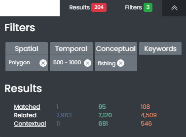
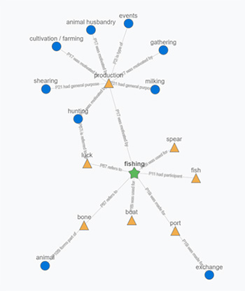
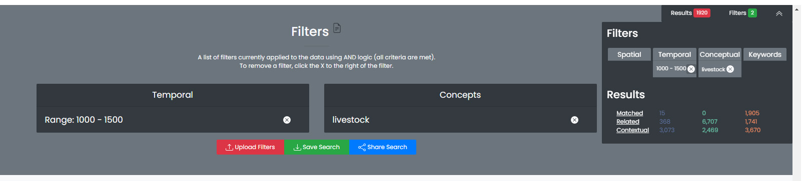
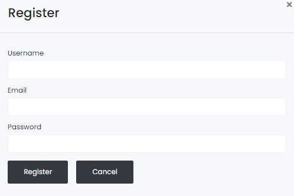
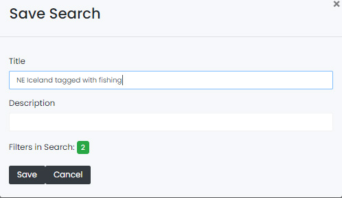
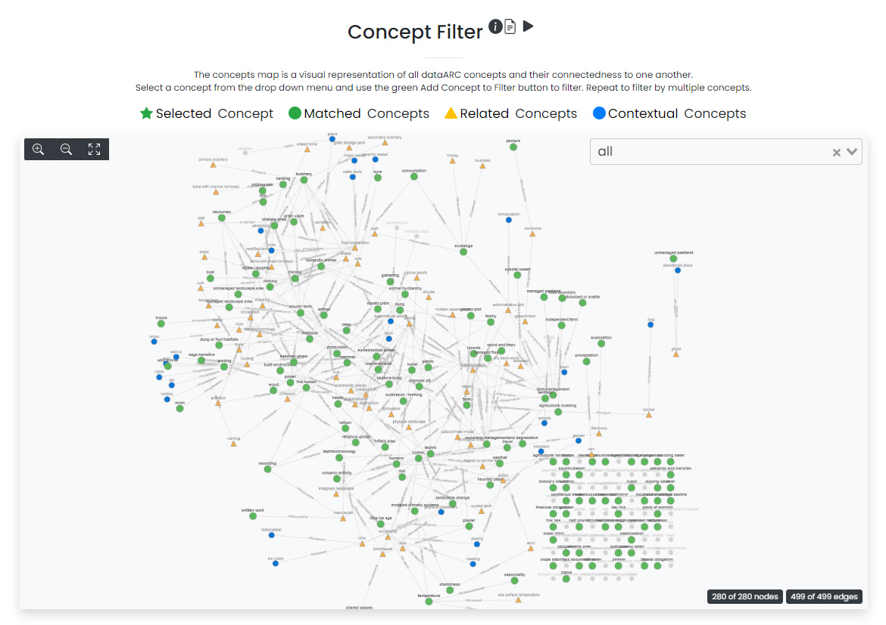
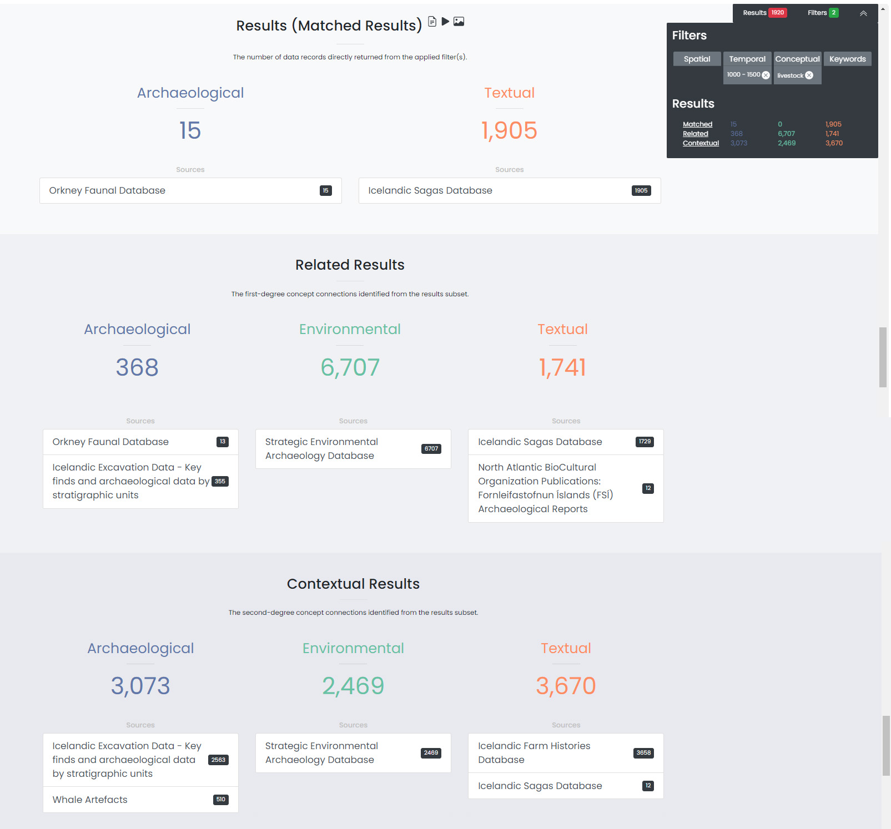

.. |Cidoc| raw:: html

   <a href="http://www.cidoc-crm.org/" target="_blank">CIDOC CRM ontology</a>

.. |DataARC| raw:: html

   <a href="https://www.data-arc.org/" target="_blank">dataARC website</a>
  
.. raw:: html

    
    
    
    
.. raw:: html

    
    
    
    
    
.. role:: bluish

.. role:: orangish

.. role:: greenish

.. role:: conceptgreen

.. role:: conceptblue

.. role:: conceptyellow

What is the dataARC search tool?
=================================

This dataARC search tool is designed to help students and researchers discover and explore diverse interconnected data sources relevant for interdisciplinary studies of long-term human ecodynamics in the North Atlantic. Search results produced through this tool will include data provided by specialists in different domains, information about the connections between these datasets, and background information about the data sources and how they are typically used. The aim of the tool is to encourage users to assess the potential relevance to their research of datasets from outside their own area of expertise. It’s important to understand how datasets are interconnected in the tool to apply filters effectively and interpret your search results correctly. 

.. image:: _static/dataarc.jpg

What kind of data is available through the search tool?
----------------------------------------------------------

The dataARC search tool includes diverse datasets contributed by researchers working in domains from Saga Studies through paleoentomology. Because the data are quite varied, and because these very different types of data have to be analysed and interpreted in different ways, we've categorized them into three general types:  archaeological, textual, and environmental.  Throughout the dataARC Search Tool, :bluish:`archaeological sources are always shown in blue`, :orangish:`textual in orange`, and :greenish:`environmental in green`.  This simple color scheme is used throughout to visually categorize the data visualization graphs, filter, and result options. 

How do I run a basic search?  What happens when multiple filters are applied?
------------------------------------------------------------------------------

There are four methods for filtering or querying data in dataARC:

        -          Time (temporal filter)
        -          Space (spatial or geographic filter)
        -          Concepts (conceptual filter based on |Cidoc|)
        -          Keyword (traditional keyword search)
        
A user may choose to define one or a combination of filters.  The time, space, and concept filters each feature a graph that provides the user with a quick visual indication of the quantity of data available for different time periods, different locations, and connected to different concepts.  As the user begins to filter the data, the information depicted in each graph changes based on the newly filtered results.  For example, if the user applies a temporal filter of 500-700 CE and gets a 2,500 result subset, then the map and concepts visualizations are updated to only show the data from those 2,500 newly selected records.  The aim is to help researchers identify areas that are data-rich across multiple datasets. Most users will be familiar with where the data-rich areas are for their own domain, but won't know where good sets of complementary data from other domains are available. A detailed guide on how to use each filter is provided in the sections below.

.. note:: Helpful Tip:  The filters do not need to be completed in any particular order.  Feel free to start with a concepts filter.  We recommend applying a filter and then revisiting the other data visualization graphs to view the changes that reflect the newly selected data.  The dynamic data visualization graphs are a powerful feature of dataARC.

Temporal Filter: How do I create a temporal filter?
=====================================================

The dataARC timeline provides a visual indication of data availability or richness for different temporal ranges (e.g. millennium, century, and decade).  If you have a specific time period that you are interested in, it is recommended to explore the timeline graph to assess data availability for your defined period.  The data in the timeline are displayed according to the dataARC color scheme (:bluish:`archaeological`, :orangish:`textual`, and :greenish:`environmental`) with **darker colors indicating more data and lighter colors indicating less data.**  

.. image:: _static/timeline.jpg

Assess data availability and create a temporal filter for a period of interest
-------------------------------------------------------------------------------

1.  To begin using the timeline graph, select a millennium of interest.  Once a millennium is selected, the graph changes to show the data availability by century.  Select a century (if applicable).  The graph changes again to show data availability by decade.  Select a decade (if applicable).

2.  To view the exact number of data records availble in the desired time period, hover over each colored square in the graph.

3.  When you are ready to begin entering your filter parameters, it is important to note that the time last selected in the timeline graph will be auto-populated in the *Begin Date* and *End Date* boxes of the Filter dialog.

4.  Modify the *Begin Date* and *End Date* if necessary to reflect the period of interest.  Make sure all BCE dates are represented with a negative number.

5.  Select *Add Temporal Filter*.

.. note:: Note:  If little data is available for the desired time period, consider widening your date range to include more data.  Use the graph to view data richness in neighboring time windows to better inform your decision.

Create a Temporal Filter for a predefined time period. 
---------------------------------------------------------

Archaeologists, geologists, climatologists, and literary historians all think about time differently. Predefined time periods are focused on discrete events (e.g. the Indonesian volcano eruption in 1257), rapid events (e.g. the Black Death in Norway from 1347-1350), or larger periods of time (e.g. the Early Medieval Period from 1050-1250) that are commonly referenced in the different disciplines represented in dataARC.  

1.  To see a list of the available predefined time periods,  select the dropdown list under *Time Period*.

2.  Choose a predefined time period. 

3.  Ensure the start and end dates match the desired predefined time period. Make sure all BCE dates are represented with a negative number.

4.  Select *Apply Filter*.

Quick Results Evaluation (optional)
--------------------------------

1.  Once the filter has been applied, the gray *Filters and Results* dialogue box on the right of the screen will update to show the new filter and results subsets.

2.  Click on the Matched, Related, or Contextual links to go to the appropriate result section at the bottom of the screen (and go to `Interpreting Results <#interpreting-results-why-do-i-have-three-sets-of-results>`__)  or continue on to another section to add another filter.

3.  It is important to note that the data displayed in the other visualization graphs are updated based on newly applied filter and results subset. 

Spatial Filter: How do I create a spatial filter?
===================================================================

Much like the timeline, the dataARC earth map interface is meant to rapidly convey data availability and richness across the multiple countries and island groups that make up the North Atlantic.

.. image:: _static/maps.jpg

Assess data availability for an area/country of interest and create a spatial filter
--------------------------------------------------------------------------------------
1.  First zoom in on the map and view the distribution of :bluish:`archaeological`, :orangish:`textual`, and :greenish:`environmental` records available for your area of interest. To zoom in on the map, either scroll with your mouse or use the plus and minus icons located in the upper right corner of the map.  Pan using the left mouse button.

2.  Once an area of interest has been identified, use the Box Select or Lasso Select tools located in the upper right corner to draw a polygon around the area.   The filter is automatically applied when you release the left mouse button.

Quick Results Evaluation (optional)
--------------------------------
1.  Once the filter has been applied, the gray Filter and Results dialogue box on the right of the screen will update to show the new filter and results subsets.

2.  Click on the Matched, Related, or Contextual texts to go to the appropriate result section at the bottom of the screen (and go to `Interpreting Results <#interpreting-results-why-do-i-have-three-sets-of-results>`__) or continue on to another section to add another filter.

3.  It is important to note that the data displayed in the other visualization graphs be updated based on newly applied filter and results subset. 

Conceptual Filter: How do I create a conceptual filter?
=============================================================

Concepts are used to build links across the different disciplines’ datasets represented within dataARC. Building these links is important and is quite challenging in practice! How a zooarchaeologist thinks about and identifies different types of fish and fishing-related activities is quite different from how a saga specialist thinks about the same topics. Yet both researchers do work that involves thinking about and studying them. dataARC uses a ‘map’ of these shared concepts, like fish and fishing, as points of connection between data used by different domains.

This map of shared concepts was developed by the dataARC community in the form of a domain ontology, also referred to in our documentation as a concept map, around the central concept of the 'changing landscape' in the North Atlantic. All of the concepts shown on the concept map are broadly related to, or directly connected to, one another.  This concept map, represented as a graph where concepts appear as nodes and the reasons for connections between them appear as edges, is the primary means for visualizing and exploring connected concepts in dataARC. For more on how the dataARC ‘changing landscapes’ ontology was developed, visit the |dataARC|.

.. image:: _static/concept.jpg

Explore the concept map, observe concepts and their connections.  Create a conceptual filter.
------------------------------------------------------------------------------------------------

1.  Zoom in on the concept map by using your mouse's scroll feature.  Select a concept of interest or use the drop down list at the top right to select a specific concept.

2.  Once selected, the graph changes to show the selected concept as a :conceptgreen:`green star`.  Concepts directly related (first degree) to the selected concept are shown with :conceptyellow:`yellow triangles` and concepts loosely related (second degree) to the selected concept are shown with :conceptblue:`blue circles`  The first-degree connections become related results and the second-degree connections become contextual results.  See the :ref:`Why?<Why? An interactive visualization tool for understanding your results>` section at the bottom of the screen for a more in-depth explanation of connections.

3.  Selecting another concept resets the graph and focuses the graph on the newly selected concept.  

4.  To filter based on the selected concept (shown with a :conceptgreen:`green star`), select the green *Add Filter* button at the top left.  

5.  Select the *Show All Concepts* button in the top right corner to reset the graph.

6.  Repeat for multiple concepts, if desired. Filtering by more concepts will yield more results.  Filtering by the "insects" and "land management" concepts will return fields that have been tagged with either the "insects" or "land management" concepts but not necessarily both.

Quick Results Evaluation (optional)
--------------------------------
1.  Once the filter has been applied, the gray *Filters and Results* dialogue box on the right of the screen will update to show the new filter and results subsets.

2.  Click on the Matched, Related, or Contextual links to go to the appropriate result section at the bottom of the screen (and go to `Interpreting Results <#interpreting-results-why-do-i-have-three-sets-of-results>`__) or continue on to another section to add another filter.

3.  It is important to note that the data displayed in the other visualization graphs are updated based on newly applied filter and results subset. 

**A closer look at concepts**

In the example to the left, fishing is the selected concept (represented with a :conceptgreen:`green star`).  In the image, we can see that fishing is also directly (one degree) related to fish, boat, spear, port, bone, luck, and production. These items are first-degree connections (represented with :conceptyellow:`yellow triangles`).  Continuing outward, we observe that some first-degree connections also have connections.  For example, production is related to fishing and is also related to other forms of production (e.g. hunting, milking, shearing, etc..), represented by :conceptblue:`blue circles`. These other forms of production are second-degree connections to fishing.  They are the friends-of-friends, so to speak, in the social world.  First- and second-degree concept connections are important in dataARC because they are used to create the Related Results (first degree) and Contextual Results (second degree) for your search. Go to the  `Interpreting Results <#interpreting-results-why-do-i-have-three-sets-of-results>`__ for a complete description of how the results are generated.
   
Keywords Filter: How do I search by keywords?
====================================================

When you want to search the database for a specific term (that is not a dataARC concept), a keyword search is likely best.  In dataARC, keywords are commonly occurring words that have been auto-generated from the text fields in the database.  It is recommended to first check the Concepts list for your term before doing a keyword search because a Concept Search specific to the term will return more valuable and directly-applicable related and contextual results.

To search by keyword, type the word and click the *Add* button on the right.  To remove the keyword from the search, select the *Remove Tag* button next to the term.  Like Concepts, the Keyword search is cumulative. So the more keywords that you add to the search, the more results you'll get.  Searching by "ice" and "fjord" and "valley" will return fields that have either the ice or fjord or valley keywords in their text. 

When a keyword search is combined with another filter, like a temporal filter, it is combined using AND logic.  For example, if temporal filter = 1,000 - 1,200 CE, keywords filter = ice or fjord, the results will return all records with a date in the range of 1,000 - 1,200 CE that also have either the ice or fjord keywords in their text.

Filters/Download Data
=====================

The filters section provides a list of all of the applied filters by filter type (temporal, spatial, conceptual, or keyword) and also provides options to save/download your results.  Filters in dataARC are applied using AND logic meaning that all filter criteria are met.  For example, if spatial filter = Iceland and concept filter = fishing, then the results will contain records located in Iceland that have also been tagged with the fishing concept.  

To remove a filter, click the remove button (X) to the right of each filter. Removing a filter will update the results list.   A running list of applied filters and results is also shown in the *Filters and Results* dialog box on the right side of the screen.

Download Data
--------------

In order to download and save the results produced in the dataARC Search Tool, you have to first create a dataARC account.  To create an account, click the “Signup” button located on the far right of the top menu bar.  Next, you will be prompted to register by entering a username, email address, and password.  Once you have successfully registered, you will then be prompted to login to the site.

Go to the Login screen and enter your site credentials.

Now that you are successfully logged in, you are ready to download your data.  Go back to the Filters section and select the green Save Search button. Enter a Title and description for your new dataset and select Save.  

The newly saved dataset can now be accessed in your dataARC profile.  Select Manage - Profile (replaced Login text) located at the top right of the menu.  Your new dataset will be listed under Saved Searches.   Select Request Download to download the data in jSON format.  If you are interested in previewing what datasets are in your search result, go to the :ref:`Results Preview<Results - Preview the data>` section.  To better understand the three types of results (matched, related, and contextual), refer to the :ref:`Interpreting Results<Interpreting Results: Why do I have three sets of results?>` section below.  To better understand **why** you recieved the results that you did, visit the :ref:`Why?<Why? An interactive visualization tool for understanding your results>` Section.

Interpreting Results: Why do I have three sets of results?   
===============================================================

The results section consists of three sections of results (matched, related, and contextual) that are grouped into :bluish:`archaeological`, :orangish:`textual`, and :greenish:`environmental` categories. The matched results are the number of data records directly returned from the applied filter(s).  Related and contextual results are the first- and second-degree concept connections identified in the matched results subset. Refer to the discussion above "A closer look at concepts" for a more detailed discussion of first-degree (related) and second-degree (contextual) connections.

Results (Matched Results)
--------------------------
The Results section displays **the number of records directly returned from one or more applied filter(s)**.  A simple filter example of “Time equals 500-700 CE” would return all data records with a date within the range of “500 - 700 CE.” These records are matched results.  

Related and Contextual Results
-------------------------------
Related and contextual results are linked **conceptually** to the matched results.  These result sets contain the data that are linked to first-degree (related) and second-degree (contextual) connections of the concepts included in the matched result subset.  This is explained in greater detail below and applies to any combination of temporal, spatial, and keyword filters.  When a concept filter is applied (individually or in combination with another filter), the related and contextual are the first-degree (related) and second-degree (contextual) concept connections of only the selected concept.  

Let's revisit the first filter example, Temporal filter (500-700 CE).  Conveniently, dataARC has the visualization tools built-in to help convey how related and contextual results work.   After applying “Temporal filter (500-700 CE)”, scroll down to the Concepts map and view all of the selected concepts pertaining to the new record subset.  In the example shown below, lets say that there are 3500 results and that those results share 50 concepts.  Those 50 shared concepts referred to as "matched concepts" are depicted as :conceptgreen:`green circles` in the Concept graph. The related results are the first degree connections of the matched concepts depicted as :conceptyellow:`yellow triangles` and the contextual results are the second degree connections of the matched concepts depicted as :conceptblue:`blue circles`.  

Because of the extreme interrelated nature of the data, a first degree connection can also be a matched concept if multiple conceptual filters are applied.  Therefore to avoid data duplication, all matched results are removed from the related results subset.  And all matched results and related results are removed from the contextual results subset.   
Therefore the matched results, related results, and contextual results for the temporal filter of “Time = 500-700 CE” are as follows:

**Temporal filter (500-700 CE)**
 
* **Matched results:**  All data records with a date within the range of 500 - 700 CE.  These results have concepts attached to them referred to as matched concepts.

* **Related results:**  All data records with concepts identified as first degree connections of the matched concepts LESS the matched results

* **Contextual results:**  All data records with concepts identified as second degree connections of the original matched concepts LESS the related results AND LESS the matched results 

It is important to note that related and contextual results are produced in the same manner for any combination of temporal, spatial, and keyword filters. However, when a concept filter is also added, then the related and contextual results will only apply to the selected concept(s).  Let's add a Concept Filter = Fishing to the filter example above.

**Temporal filter (500-700 CE) AND Concept Filter (Fishing)**

* **Matched results:** All data records with a date within the range of 500 - 700 CE and tagged with the “fishing” concept

* **Related results:**  All data records with concepts identified as first degree connections of the  “fishing” concept LESS the matched results

* **Contextual results:** All data records with concepts identified as second degree connections of the  “fishing” concept LESS the related results AND LESS the matched results.

.. note:: Related and contextual results are the first-degree (related) and second-degree (contextual) concept connections for a selected concept or for the pool of matched concepts that have been identified from any combination of temporal, spatial, and keyword filters.  

Why are related and contextual results important? 
--------------------------------------------------

The dataARC search tool was created to support intentionally interdisciplinary data discovery. Related and contextual results are important when searching interdisciplinary data and researching interdisciplinary topics.

Each dataset in dataARC is mapped to the community’s set of shared concepts by its contributor, who is an expert in a specific discipline and has a broad familiarity with the other disciplines represented in our tool. Different data contributors will have different ideas about which concepts their data speaks to most directly. This is quite normal, even inevitable! Different disciplines prioritise different concepts and these priorities change as research trends shift over time. An unintended outcome of this situation is that a search on any given concept will become discipline specific. The aim of the dataARC search tool is to encourage interdisciplinary search and to help its users to see connections and find data across these conceptual divides between specialisms and disciplines.

Let's explore this with an example:

  A specialist in Saga Studies might feel confident that some of her data is directly relevant to studies of production, but not feel confident that it provides direct evidence for animal husbandry. A zooarchaeologist might think that some of his data speaks directly to animal husbandry, but that the concept of production is too broad to be useful. These two researchers won’t map their data to the same concepts. This means that a search on any given concept will  likely miss out relevant data from other disciplines because of basic gaps in their core vocabularies and how researchers trained in them think about their data. 
 
  While our experts in this example will (for good reasons) map their data to the concepts to which it speaks with the most fidelity, they’ll agree that the concepts of production and animal husbandry are directly connected. This agreement has been captured in the concept map.

  A second zooarchaeologist using the dataARC search tool would likely search using the concept animal husbandry because he shares a disciplinary background and vocabulary with the other zooarchaeologist. To help this second zooarchaeologist to discover the saga studies data, which might be relevant to his research question, the dataARC search tool presents results connected to topics the interdisciplinary community thinks are closely related - bridging disciplinary divides created when we search using our own discipline’s ‘obvious’ default terms. 

------

In the dataARC search tool, the most directly connected concepts and their mapped data are one-degree away on the concept map. Less connected but still potentially relevant concepts and their mapped data are two-degrees away. 

Why not just group all the direct, related and contextual results together?
---------------------------------------------------------------------------

The dataARC search tool could, of course, group together all the results, rather than splitting them out based on how closely, conceptually speaking, they are related to the original search term. We’ve chosen to structure the results by how closely they are connected to the original search term, and to expose the explanations of these connections to help users to understand how experts from diverse domains have assessed the relevance of their data to shared different concepts. 

Because the data and disciplines collected together through the dataARC search tool are so diverse, it’s likely that as a user you will encounter data with which you’re really quite unfamiliar and find yourself uncertain about how relevant it is to your original search terms and what that relevance might be. The *direct*, *related* and *contextual* tiers of search results indicate the degree of relevance. 
 
Results -  Preview the data 
----------------------------

Before you download your data, you can preview the different datasets returned from your search filters in the Results section. The results are grouped by the :bluish:`archaeological`, :orangish:`textual`, and :greenish:`environmental` classification used throughout the site with the number of records returned listed under each category. The different datasets and the number of records returned in each dataset are also listed under each category. To view the records returned, click on the dataset name.  Once in the dataset view window, you can view individual records and also basic metadata about the project and the dataset fields.  When you are ready to download your data results, return to the :ref:`Filters/Download Data` section.  To better understand why you received the results that you did, visit the :ref:`Why?<Why? An interactive visualization tool for understanding your results>` Section.

Why? An interactive visualization tool for understanding your results
=====================================================================

The *Why* section is broken into 6 linked-view panels to help you to understand *why* the tool has returned your filtered search results. This section of the tool exposes relationships that not only exist between the different concepts used in your search, but also between concepts and related data (combinators). The combinators have been handcrafted by dataset creators and domain experts and are intended to enable users from other disciplines to discover the conceptual links which are implicit in domain-specific knowledge, which wouldn't be obvious outside the specialist research community. These connections are described with reference to key literature in each domain. These descriptions and citations can be accessed in the "Combinator details" panel.

The 3 panels along the top portion of this section display the concepts, combinators, and datasets (from left to right) returned by your query, while the panels in the lower portion update to show the details for concepts, combinators, and datasets selected elsewhere in the *Why* section. In any of the 6 linked views, clicking on concepts or combinator items allows you to see additional details. Hovering over concepts or combinators will highlight them in any box where they are displayed, enabling you to see connections, and whether they were included in your query.

Why: Concepts for Query
-----------------------

The upper left panel is the main panel for exploring concepts returned by your query. It provides several viewing options for the concepts, and is linked with many of the other panels to help explain connections to your query results, which you can use to help refine and/or broaden your search. You can expect that the concepts that you hover over in this section will highlight concepts and related combinators (relationships with datasets that include the concept) in other panels, and that hovering over concepts and combinators in other panels will highlight concepts in this panel. 

* Filters:

  * View all concepts, or filter on matched, related, contextual

* Views:

  * **Listed** - Scrollable list view of the filtered, clickable concepts and concept type

  * **Grouped** - Clickable concepts are collected under expandable lists of concept type

  * **Inline** - All the filtered, clickable concepts displayed with little whitespace for maximum concept viewing.

* Actions:

  * Hover over a concept to highlight the same concept in any other linked-view panel along with any combinators that include the concept. It may be most useful to click the “Inline” view of Concepts in panels where they are displayed to see all highlighted concepts. 

  * Clicking on individual concepts provides more details about the concept in the lower left panel. 

Why: Combinators for query
--------------------------

The upper middle panel lists the combinators related to your query. Combinators are the relationships, or mappings, between datasets and concepts, and have been constructed by the researchers who have contributed or worked closely with the connected dataset. These mappings include their own explanations of *why* the data is relevant to the concepts, and provide the citations for these explanations. The descriptions of the combinators are essential to this project’s attempt to explain how your search results are constructed and *why* data from different sources are connected through shared concepts.

Clicking on a listed combinator populates the lower middle panel with its details, including a description of the combinator, its related concepts (these may not have been included in your query), and supporting citations. The full set of concepts mapped to your combinator provides further insight into the research context in which the data is usually interpreted by the data contributor.

* Filters:

  * View all combinators, or filter on matched, related, and contextual results

* Views:

  * A scrollable list of combinators related to your query

* Actions:

  * Hover over a combinator to highlight related concepts that are displayed in any other linked-view panel. It may be most useful to click the “Inline” view of concepts in panels where they are displayed to see all highlighted concepts. 

  * Click on a combinator to view its details in the lower middle panel, including a description of the combinator, its connected concepts, and citations from which the combinator was derived. See the "Combinator details" description below for interpreting information further. 

  * Once a combinator is selected and its details are displayed in the lower middle panel, hover over other combinators in the upper middle panel to highlight related concepts in any *Why* panel displaying concepts.

Why: Dataset results for query
------------------------------

The upper right panel lists the datasets returned by your query, color coded by their  :bluish:`archaeological`, :orangish:`textual`, and :greenish:`environmental` classifications. Similar to the "Combinators for query" panel, here you can explore the datasets to gain a better understanding of the scope of applications and connections researchers associate with the individual datasets. Click on a dataset in the list to populate the lower right panel with its details, including a brief description and a list of all the dataset’s combinators. From there, each of the combinators and its concepts can be explored by the same methods as those returned in the query.

* Filters:

  * View all datasets, or filter on matched, related, and contextual results

* Views:

  * A scrollable list of datasets related to your query

* Actions:

  * Click on a dataset to populate the lower right panel with a full list of the combinators associated with the dataset, some of which may not have been returned by your query.

  * Click on a combinator in the lower right section will populate its details in the "Combinator details" panel

Why: Concept Details
--------------------

The lower left panel is initially blank, but populates with the details of concepts selected in the other *Why* panels -- "Concepts for query" and "Combinator details". Concept details include concept type, a link to the full scope notes for the concept, citations for reference, and related and contextual concepts.

* Actions:

  * Click on the link beside "For further details" to open the Scope Notes on a concept in a new window or tab.

  * Click on the black arrow beside the concept to expand a list of nested related and contextual concepts and their respective concept types.

  * Hover over a concept to highlight the same concept in any other linked-view panel along with any combinators that include the concept.

Why: Combinator Details
-----------------------

The lower middle panel is initially blank, but populates with the details of Combinators selected in the other *Why* panels -- "Combinators for query" and "Dataset details". Combinator details include a brief description of *why* the data is related to the concepts, all of the concepts associated with the combinator (including those that may not have shown up in your query), and citations for reference.

This section is a key to considering how you may be able to widen and/or refine the scope of your query to include additional datasets since it allows you to explicitly see the distinct connections other researchers make between concepts and datasets.

* Views:

  * **Listed** - Scrollable list view of filtered clickable concepts and concept type

  * **Grouped** - Clickable concepts are collected under expandable lists of concept type

  * **Inline** - A view of all the filtered clickable concepts

* Actions:

  * Click on a concept to explore it in more detail in the lower left "Concept details" panel.

  * Hover over a concept to highlight the same concept in any other linked-view panel along with any combinators that include the concept.

Why: Dataset details
--------------------

The lower right panel is initially blank, but populates with the details of a dataset selected in the "Datasets for query" panel. Details include a description of the dataset, which is scrollable for longer descriptions, and a scrollable list of clickable combinators associated with this dataset (including those that may not have shown up in your query). The linked-view of all the panels once again means that hovering over combinators will highlight its connected concepts appearing in other Why panels.

* Views:

  * A scrollable list of combinators related to a selected dataset.

* Actions:

  * Scroll through the entire dataset description

  * Click on combinator to view its details in the lower middle "Combinator details" section.

  * Hover over a combinator to highlight concepts that are displayed in any other linked-view panel. It may be most useful to click the "Inline" view of concepts in panels where they are displayed to see all highlighted concepts. 

