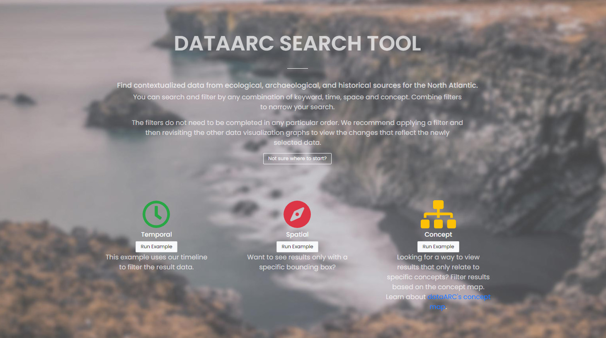

.. DataArc Ecosystem Explorer documentation master file, created by
   sphinx-quickstart on Sat Jul 11 15:20:33 2020.
   You can adapt this file completely to your liking, but it should at least
   contain the root `toctree` directive.

.. |DEE| raw:: html

   <a href="https://github.com/ropitz/dataarc-demo" target="_blank">DataArc Ecosystem Explorer</a>
   
.. |DPW| raw:: html

   <a href="https://www.data-arc.org/" target="_blank">DataArc project website</a>

.. |DST| raw:: html

   <a href="https://ui.data-arc.org/" target="_blank">DataARC Search Tool</a>
   
.. |WS| raw:: html

   <a href="https://www.data-arc.org/contributors-toolbox/map-your-data/" target="_blank">materials</a>
   
.. |WS2| raw:: html

   <a href="https://www.data-arc.org/contributors-toolbox/map-your-data/" target="_blank">Conceptual Guide</a>

  
  
Accompanying the |DPW| and the |DST|, this guide provides "how-to" information on all things dataARC!  The result of two successful NSF awards (cyberNABO 1.0 and 2.0 - SMA 1439389 and1637076) and a strong international research collaboration, dataARC bridges data from the humanities to the environmental sciences to support the interdisciplinary study of human ecodynamics in the North Atlantic.  Read more about the project background, the research team, and the wide array of datasets available in dataARC on the |DPW|.  Also learn how to use the |DST| in your research!  

Reference the `dataARC Search Tool Help <dataarc-tool-help.html>`__ to learn how to use the temporal, spatial, and conceptual visualization graphs, how to create and combine filters, and how to download and interpret your results.  Finally, interested in adding your data to dataARC?  dataARC is all about open data and collaboration!  Be sure and visit the Learn how to add your data section to learn more!

`DataARC Search Tool Help <dataarc-tool-help.html>`__
========================

The |dst| is the online interface that allows users to query the archaeological, textual, and environmental data in dataARC.  Learn ho to filter data temporally, spatially, conceptually, and by keyword search.  Use `this guide <dataarc-tool-help.html>`__ to better understand how the dynamic data visualization graphs work, how to filter and optimize your results, and also how to download your data.  

Interested in Adding your data?  Learn how...
=============================================

Preparing your data for ingest into dataARC will be a multistep process.  If you haven't already, familiarize yourself with the |DST| and take a thorough glance of the contents of the |DPW| to better understand the project context and how the data are structured.  Next, you will want to step through each of the sections below.
  
   
1. A |WS2| to Devoloping Good Mappings for your Data
----------------------------------------------------------------
.. image:: _static/dataARC_chart3.jpg
   :width: 400
   :class: align-left
Thinking about how to map your data to the DataArc community's shared concept map can be challenging. Graduate students working with the project team have developed materials to guide PhD students considering contributing their data. These |ws| designed to be used in a workshop, are relevant to anyone considering contributing project data to the DataArc Ecosystem and should be reviewed before creating combinators for your dataset. 

|
|

2. `Learn how <ecosystem_explorer.html>`__ to use the dataARC Ecosystem Explorer! 
----------------------------------------------------------------------------------
The |dee| is a virtual sandbox designed to help dataset contributors think through mapping their data to the DataArc community's knowledge map of the
concept of "changing landscapes." It is also designed to help advanced users better understand how data and concepts are connected in the
DataArc Ecosystem. Use `this guide <ecosystem_explorer.html>`__ to walk you through learning the Ecosystem Explorer toolset that is provided as a Jupyter Notebook.  

`The Data Network Overview Analyses notebook <https://github.com/ropitz/dataarc-demo/blob/master/Data%20Network%20Overview%20Analyses%20-%20Final.ipynb>`__ allows you to calculate graph metrics like betweenness centrality on the dataARC concept map.  It is a useful tool for beginning high-level exploration of how different concepts are connected and currently runs off of the dataARC API. 

3. Add your dataset using Github
----------------------------------
.. image:: _static/GitHub.png
   :width: 150
   :class: align-left
Now that you have a better understanding of how to map your data to the dataARC concept map and you've experimented with creating combinators using the dataARC Ecosystem Explorer, you are ready to begin uploading your data into dataARC.  `Click here <add-new-dataset.html>`__ for step-by-step guidance for creating your dataset, uploading it to Github, and creating combinators in dataARC.  

 
